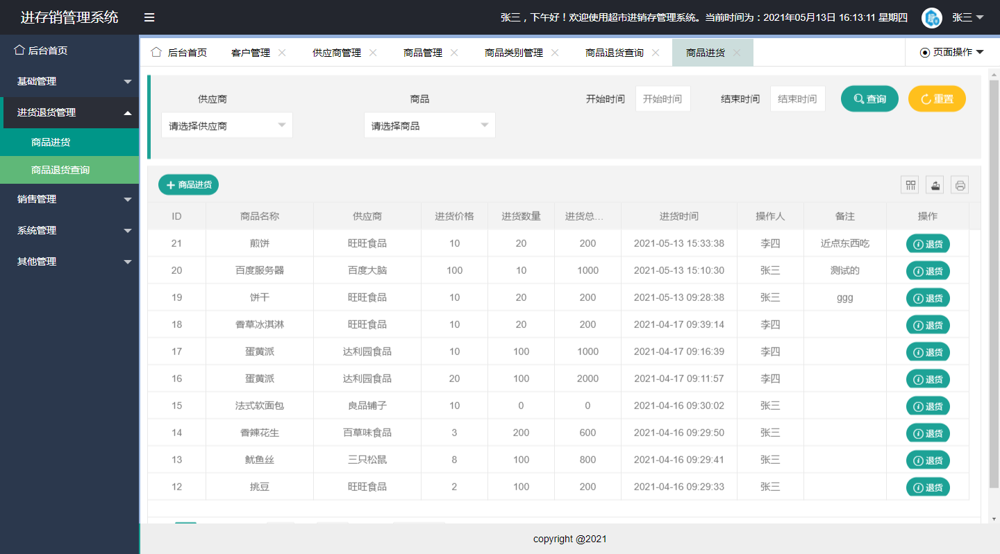

本系统为基于spingboot的进存销管理系统

项目代码已收录公众号【java项目源码】，需要请自行关注一下公众号并下载源码

技术：SpringBoot+LayUI+MySQL+Shiro+MybatisPlus+Echarts

功能：本系统根据权限划分为三种用户：系统管理员，货物管理员，商品管理员（具体角色可以根据权限划分多个）
系统管理员默认功能：客户管理，供应商管理，商品管理，商品类别管理，商品进货，商品退货查询，
商品销售，商品销售退货，权限管理，角色管理，用户管理，日志管理，统计报表等

货物管理员默认功能：商品进货，商品退货查询

商品管理员默认功能：客户管理，供应商管理，商品管理，商品类别管理，商品销售，商品销售退货

（注：所有用户的角色菜单都是可配置的）
管理员密码：admin 12345
用户默认密码：000000 （重置后的密码）

CSDN博客地址：[基于spingboot的进存销管理系统](https://blog.csdn.net/mataodehtml/article/details/117293427)

运行视频地址：[基于spingboot的进存销管理系统](https://www.bilibili.com/video/BV1gb4y1f7CE)

